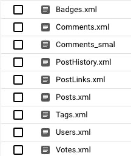

### Stack Overflow Log Analysis with MapReduce

The project involves extracting data from several smaller datasets and combining them together to do analysis.

#### Glossary
- [SentimentAnalysis](https://github.com/ayush-usf/stack-overflow-logs-hadoop-analysis/tree/main/src/main/java/edu/usfca/cs/mr/util/SentimentAnalysis.java) : Calculates the overall sentiment from the list of provided tokens, extracted from text.

### Dataset
The dataset contains logs for askubuntu stackexchange logs (https://askubuntu.com) in XML format.
- The total size of the dataset is 22 GB.

- It is stored in the GCS bucket gs://stackoverflow-dataset-677

- The dataset includes multiple xml files corresponding to different attributes of the dataset.



- The following are the relevant features for each XML file.

  - **Users**: Reputation, CreationDate, DisplayName, WebsiteUrl, Location, Views, UpVotes, DownVotes, AccountId
  - **Posts**: Id, PostTypeId, AcceptedAnswerId, CreationDate, Score, Body, OwnerUserId, Title, Tags, AnswerCount, CommentCount
  - **Comments** : RowId, PostId, Score, Text, CreationDate, UserId, ContentLicense
  - **Tags**: RowId, TagName, Count, ExcerptPostId, WikiPostId 
  - **Badges** : RowId, UserId, Name, Date, Class, TagBased
  - **Votes** : RowId, PostId, VoteTypeId, CreationDate

### Compiling the project
- Remember to compile the project, before running jobs
    ```
    mvn compile
    ```
  
### File Path : 
```
gs://stackoverflow-dataset-677
```

### Glossary

- [SentimentAnalysis](https://github.com/ayush-usf/stack-overflow-logs-hadoop-analysis/tree/main/src/main/java/edu/usfca/cs/mr/util/SentimentAnalysis.java) : Calculates the overall sentiment from the list of provided tokens, extracted from text.

### Compiling the project
- Remember to compile the project, before running jobs (if not done for previous section)
    ```
    mvn compile
    ```
###  Analysis
#### 1. Finding the Top 5 posts with sentiments
    
  > [edu.usfca.cs.mr.stack_overflow_top5_posts](https://github.com/ayush-usf/stack-overflow-logs-hadoop-analysis/tree/main/src/main/java/edu/usfca/cs/mr/stack_overflow_top5_posts)
            
  [WeeklyPostCountJob.java](https://github.com/ayush-usf/stack-overflow-logs-hadoop-analysis/tree/main/src/main/java/edu/usfca/cs/mr/stack_overflow_top5_posts/WeeklyPostCountJob.java)        
  [TweetMapper.java](https://github.com/ayush-usf/stack-overflow-logs-hadoop-analysis/tree/main/src/main/java/edu/usfca/cs/mr/stack_overflow_top5_posts/TweetMapper.java)        
  [TweetWritable.java](.src/main/java/edu/usfca/cs/mr/stack_overflow_top5_posts/TweetWritable.java)        
  [TweetCountReducer.java](https://github.com/ayush-usf/stack-overflow-logs-hadoop-analysis/tree/main/src/main/java/edu/usfca/cs/mr/stack_overflow_top5_posts/TweetCountReducer.java)        
  - Usage:
      ```
      <Job.java> <input_file_location> <output_file_location> <positive_word_file_path> <negative_word_file_path>
      ```
    
    - `Example Output :` Ordered by total number of tweets posted by users in descending order.

    ```
    Week 8			 Total posts 2
    
                2014-02-18 13:33	Title: How can I set the Software Center to install software for non-root users?
                                    Sentiment: 2.38% positive	Score: 48	Answer Count: 5
    
                2014-02-18 13:34	Title: What are some alternatives to upgrading without using the standard upgrade system?
                                    Sentiment: neutral	Score: 22	Answer Count: 2
    
    
    Week 13			 Total posts 1
    
                2013-03-29 05:00	Title: How do I go back to KDE splash / login after installing XFCE?
                                    Sentiment: 2.85% negative	Score: 18	Answer Count: 4
    
    
    Week 30			 Total posts 1
    
                2014-07-22 19:53	Title: How do I enable automatic updates?
                                    Sentiment: neutral	Score: 142	Answer Count: 5
    
    
    Week 33			 Total posts 1
    
                2010-08-22 02:10	Title: How do I run a successful Ubuntu Hour?
                                    Sentiment: 5.08% positive	Score: 26	Answer Count: 6
    
    
    Week 49			 Total posts 1
    
                2017-12-10 23:38	Title: How to graphically interface with a headless server?
                                    Sentiment: 3.10% positive	Score: 41	Answer Count: 9
    
    
    Week 51			 Total posts 1
    
                2014-12-16 01:47	Title: How to get the Your battery is broken message to go away?
                                    Sentiment: 11.11% negative	Score: 61	Answer Count: 4
    
    
    
    ```

    - [Actual Output](./output/5%20StackOverflow-Posts.txt)
  
#### 2. Location-wise top 5 Users with Highest Reputation, ordered by highest upvotes
     
> [edu.usfca.cs.mr.stack_overflow_highest_rep_users](https://github.com/ayush-usf/stack-overflow-logs-hadoop-analysis/tree/main/src/main/java/edu/usfca/cs/mr/stack_overflow_highest_rep_users)
       
  [HighestRepUserCountJob.java](https://github.com/ayush-usf/stack-overflow-logs-hadoop-analysis/tree/main/src/main/java/edu/usfca/cs/mr/stack_overflow_highest_rep_users/HighestRepUserCountJob.java)        
  [HighestRepUserMapper.java](https://github.com/ayush-usf/stack-overflow-logs-hadoop-analysis/tree/main/src/main/java/edu/usfca/cs/mr/stack_overflow_highest_rep_users/HighestRepUserMapper.java)                
  [HightestRepUserReducer.java](https://github.com/ayush-usf/stack-overflow-logs-hadoop-analysis/tree/main/src/main/java/edu/usfca/cs/mr/stack_overflow_highest_rep_users/HightestRepUserReducer.java)        
  [LocationWritable.java](https://github.com/ayush-usf/stack-overflow-logs-hadoop-analysis/tree/main/src/main/java/edu/usfca/cs/mr/stack_overflow_highest_rep_users/LocationWritable.java)
  - Usage:
      ```
      <Job.java> <input_file_location> <output_file_location>
      ```
  - `Example Output :` Ordered by count of week-wise top 5 trending tweets in descending order.
    ```
    Algeria	Total Users :1
    [
                User : Px	 (since 2010-10-14)	 reputation=0	 upvotes=0	 views=31	 website=http://pixelmed.wordpress.com/]
    
    Argentina	Total Users :13
    [
                User : Ither	 (since 2010-11-30)	 reputation=52	 upvotes=52	 views=23	 website=NA, 
                User : bruno077	 (since 2010-10-03)	 reputation=35	 upvotes=35	 views=46	 website=http://bonamin.org, 
                User : vicmp3	 (since 2010-10-22)	 reputation=31	 upvotes=31	 views=91	 website=NA, 
                User : Axel	 (since 2010-08-04)	 reputation=19	 upvotes=19	 views=47	 website=http://localhost:8084, 
                User : Sebastián	 (since 2011-01-16)	 reputation=14	 upvotes=14	 views=26	 website=NA]
    
    .
    .
    .
    .
    
    Zimbabwe	Total Users :1
    [
                User : coolmac	 (since 2011-05-09)	 reputation=0	 upvotes=0	 views=5	 website=http://www.twitter.com/mukwenhac]
    
    ```
    - [Actual Output](./output/5%20StackOverflow_users.txt)

### 3. Extracting top 5 postIds from comments 
Analyzing Comments file from stackoverflow data, to find the top 5 postIds, the **sentiment associated** with these comments, the **users who have made these comments**, their **scores**, **dates** on which these comments are made etc.

> [edu.usfca.cs.mr.stack_overflow_top_5_postIds](https://github.com/ayush-usf/stack-overflow-logs-hadoop-analysis/tree/main/src/main/java/edu/usfca/cs/mr/stack_overflow_top_5_postIds)
    
  - File Path :`/home/ayush/comments.xml`
  
  - [Actual Output](./output/5c%20Comments.txt)
    
### 4. To find the top 5 tags
Analyzing Tags file from stackoverflow data, to find the top 5 tags, the excerptPostId and wikiPostId etc and displaying the data through the Reducer.

> [edu.usfca.cs.mr.stack_overflow_top_5_tags](https://github.com/ayush-usf/stack-overflow-logs-hadoop-analysis/tree/main/src/main/java/edu/usfca/cs/mr/stack_overflow_top_5_tags)

- File Path :`/home/ayush/tags.xml`
	